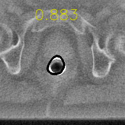

## Automatic Rectum Segmentation with Deep Learning

This repo contains the source code of the paper **Deep Rectum Segmentation for Image Guided Radiation Therapy with Synthetic Data**

### Absract

```
Image guidance nowadays is a crucial component for doctors to facilitate the design of the planning radiation therapy dosage.
The delineation of soft organs in the planning phase and during the radiation therapy is crucial for the treatment procedure.
Deep Learning (DL) flourishes, presenting state-of-the-art results in challenging computer vision tasks; however, the lack of annotated data hardens the research advancements for
medical applications. The research in this paper develops DL approaches for the segmentation of organs-at-risk and specifically from images retrieved from
a computed tomography system during the radiation treatment of each patient. The proposed approaches are based on convolutional neural architectures trained
with only a couple of thousand images, and can also be trained online, showing its learning ability from new patients.
The lack of annotated data is also addressed with synthetic data generated by a modified GAN.
Experimental results demonstrate the excellent performance of the proposed approaches in rectum segmentation task.
```

# Installation

Create your own pipenv environment by running the following 2 commands:

```bash
pipenv shell
pipenv install
```


## Synthetic Data Generation

For the synthetic data generation please consider to use the source code provided in this repo:

<a href="https://github.com/mahmoodlab/NucleiSegmentation">Synthetic Generation</a>

## Training

Place your dataset into folders splitting the images and masks and place the paths in the `train.py` script. Then pass the log file as
an argument to your script to train your model.


# Results

<div align="center">
<p>

</p>
<div>

## Test Samples
<p float="left">
  
  
  
</p>


## Synthetic Images
<p float="left">
  
  
  
</p>

